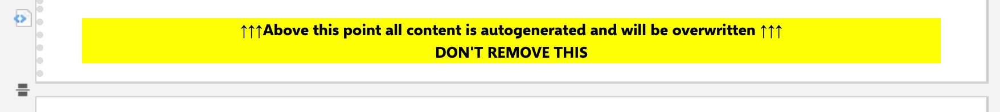

..
   Copyright DB InfraGO AG and contributors
   SPDX-License-Identifier: Apache-2.0

.. _render-docs-config:

Live-Docs rendering
===================
The high-level functionality and use cases are described in the
:ref:`feature <render-documents>` documentation page. Here it is described how
to set up the Live-Docs rendering.

Full Authority Mode
*******************
The ``full_authority_config.yaml`` file provides an example configuration for
rendering documents in full authority mode.

.. literalinclude:: ../../../tests/data/documents/full_authority_config.yaml
   :language: yaml
   :lines: 4-

This file describes the Jinja2 template for the rendering, the filename, the
location, the Polarion project ID. This means it is possible to populate
Live-Doc spaces of other projects. A status-allow-list handles the statuses on
which the Live-Doc will be updated on. If the status enum isn't provided in the
list and the Live-Doc status is changed to it, the service won't update the
Live-Doc. This facilitates an efficient and streamlined review and release
process, minimizing disruptions.

Each instance is a Live-Doc, possibly targeting a specific model element.
With `work_item_layouts` the representational configuration of work items in
the Live-Doc are managed.

Mixed Authority Mode
********************
The `mixed_config.yaml` file describes how to set up mixed authority mode
Live-Docs for automated rendering.

.. literalinclude:: ../../../tests/data/documents/mixed_config.yaml
   :language: yaml
   :lines: 4-

.. _mixed-sections-config:

Under `sections` the individual templates are listed to populate the marked
sections from the Live-Doc. The following macro is used as dividers:

.. code-block:: html

   

   #set($statusList = ["draft", "planned", "inReview"])
   #if ($statusList.contains($document.getStatus().id))
   

   DON'T REMOVE THIS 
   ↓↓↓Below this point all content is autogenerated and will be overwritten↓↓↓
   

   #end
   

This looks then like the following in the Live-Doc:

.. image:: ../_static/mixed-authority-live-doc-divider-down.png

Don't forget to do the same for closing the section:

Configuration File Templates
----------------------------
The `config.yaml.j2` file in the `documents` folder serves as the primary
configuration template for the Live-Doc rendering service. This Jinja2 template
defines how data from the Capella model should be structured and rendered into
Polarion Live-Docs.

.. literalinclude:: ../../../tests/data/documents/config.yaml.j2
   :language: jinja
   :lines: 4-

Using this template, the service can populate sections of the Live-Doc with
content based on the selected rendering mode. When working in Mixed authority
mode, the marked sections in the document will be populated, leaving the
unmarked sections untouched.
