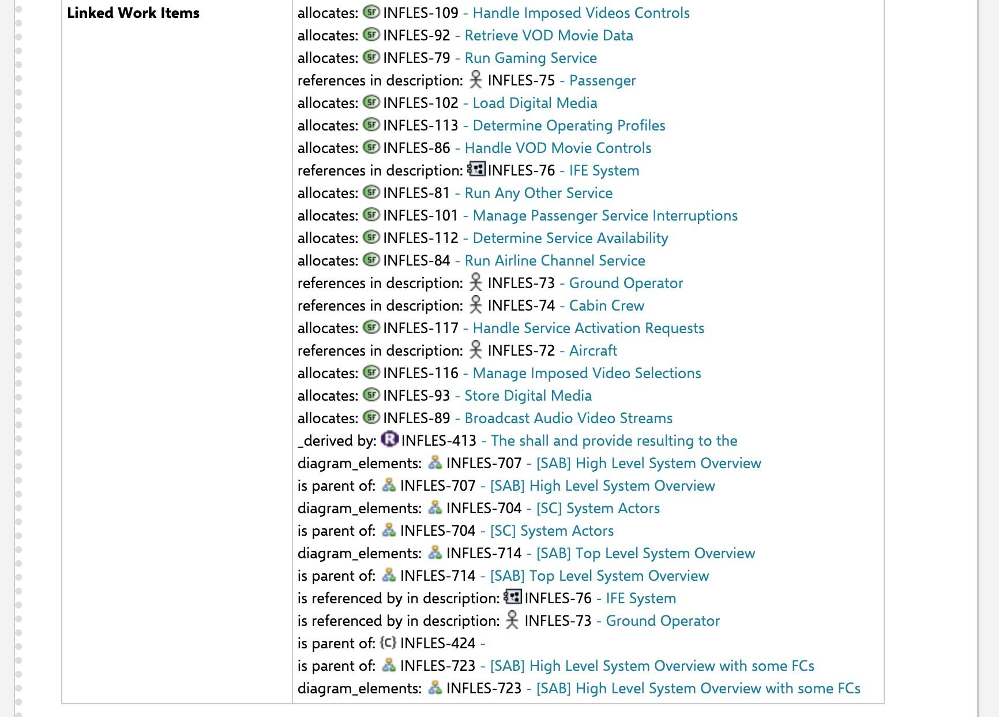
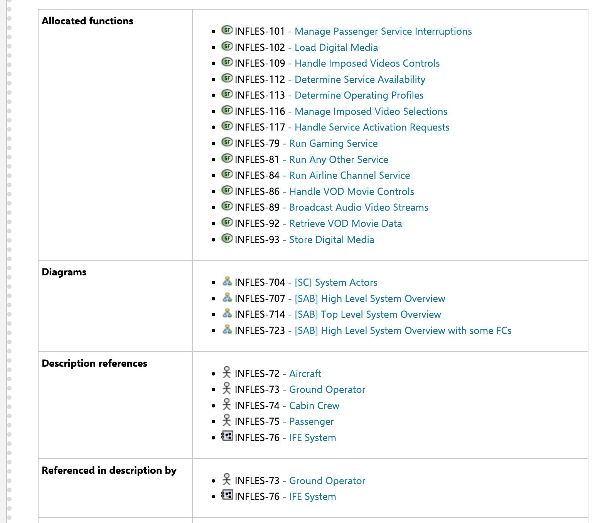

..
   Copyright DB InfraGO AG and contributors
   SPDX-License-Identifier: Apache-2.0

.. _sync:

Model synchronization
=====================
The synchronization of Capella objects as Polarion work items is done by using
the Polarion REST API. We developed a `Python client`_ where most of the
endpoints are generated from the open API description. In general, we serialize
all Capella objects fetched from the ``capellambse.MelodyModel`` instance
inferred from the capella2polarion config. Then, to reduce the number of
requests, we compare a checksum of the existing work items and the newly
created ones. If the checksum differs, a patch request will happen. If a work
item with a ``capella_uuid`` doesn't exist yet, a new work item will be
created. These custom fields ``_checksum`` and ``_capella_uuid`` are required.
Per default, capella2polarion will not delete any work items but will set the
status to deleted. However, with the ``--delete`` flag, you can enable the
deletion.

.. _Python client: https://github.com/DSD-DBS/polarion-rest-api-client#polarion-rest-api-client

Features
--------

Supported Capella types
***********************

Capella2Polarion lets you synchronize the following attributes through the
specific serializer alone:

.. _supported_capella_serializers:

+--------------------------------------+------------------------------------------------------+
| Serializer                           | Description                                          |
+======================================+======================================================+
| generic_work_item                    | The default serializer for Capella objects w/o a     |
|                                      | specific serializer. All other serializers are       |
|                                      | reusing the generic serializer.                      |
|                                      | This serializer populates: type, title,              |
|                                      | description, status, uuid_capella and                |
|                                      | requirement_types. The requirement type fields       |
|                                      | are inferred from the requirement type (this is      |
|                                      | the custom field name/id) and the value is then      |
|                                      | the requirement's text.                              |
+--------------------------------------+------------------------------------------------------+
| diagram                              | A serializer for Capella diagrams. Currently, the    |
|                                      | diagram is taken from the diagram_cache, served      |
|                                      | from a GitLab artifact URL and attached as SVG and   |
|                                      | PNG.                                                 |
|                                      | You can provide ``render_params`` in the config and  |
|                                      | these will be passed to the render function of       |
|                                      | capellambse.                                         |
+--------------------------------------+------------------------------------------------------+
| include_pre_and_post_condition       | A serializer adding post- and precondition           |
|                                      | fields. Usually used for ``Capability`` s.           |
+--------------------------------------+------------------------------------------------------+
| linked_text_as_description           | A serializer resolving ``Constraint`` s and their    |
|                                      | linked text.                                         |
+--------------------------------------+------------------------------------------------------+
| add_context_diagram                  | A serializer adding a context diagram to the work    |
|                                      | item. This requires node.js to be installed.         |
|                                      | The Capella objects where ``context_diagram`` is     |
|                                      | available can be seen in the `context-diagrams       |
|                                      | documentation`_.                                     |
|                                      | You can provide ``render_params`` in the config and  |
|                                      | these will be passed to the render function of       |
|                                      | capellambse.                                         |
|                                      | You can provide ``filters`` in the config, and these |
|                                      | will be passed to the render function of capellambse.|
|                                      | See `context-diagrams filters`_ for documentation.   |
+--------------------------------------+------------------------------------------------------+
| add_tree_view                        | A serializer adding a tree view diagram to the       |
|                                      | work item. Same requirements as for                  |
|                                      | ``add_context_diagram``. `Tree View Documentation`_. |
|                                      | You can provide ``render_params`` in the config and  |
|                                      | these will be passed to the render function of       |
|                                      | capellambse.                                         |
|                                      | ``filters`` are available here too.                  |
+--------------------------------------+------------------------------------------------------+
| add_jinja_fields                     | A serializer that allows custom field values to be   |
|                                      | filled with rendered Jinja2 template content. This   |
|                                      | makes it possible to add complex HTML structures     |
|                                      | like tables or lists to the work item as custom      |
|                                      | fields.                                              |
+--------------------------------------+------------------------------------------------------+
| jinja_as_description                 | A serializer that uses a Jinja2 template to render   |
|                                      | the description content of a work item. Similar to   |
|                                      | ``add_jinja_fields``, but specifically for the       |
|                                      | description field.                                   |
+--------------------------------------+------------------------------------------------------+

.. _context-diagrams documentation: https://dsd-dbs.github.io/capellambse-context-diagrams/#context-diagram-extension-for-capellambse
.. _Tree View documentation: https://dsd-dbs.github.io/capellambse-context-diagrams/tree_view/
.. _context-diagrams filters: https://dsd-dbs.github.io/capellambse-context-diagrams/extras/filters/

Links
*****

Attributes on Capella objects referencing other Capella objects are rendered
as linked work items if (and only if) the link target exists as a work item in
Polarion. This needs specific configuration in the work item link roles XML.
If the configuration is done, any Capella attribute can be rendered as a link.
Per default any configured link will cause the rendering 2 custom fields:

1. Grouped linked work items
2. Grouped backlink work items (on the link target work items)

Grouped linked work items
*************************

In a Polarion live-doc, there is no way to filter the linked work items table
which is automatically created from Polarion and can be included in the
document:

Therefore, Capella2Polarion creates two custom fields for each link configured.
The linked work items are then grouped: A direct field with a list of the links
and a field for the reverse links on each target:

For now this feature can not be disabled. Keep in mind that this requires
configuration of 2 new custom fields on the work item type and the targeted
work item type. See the :ref:`linked work items configuration documentation
page <links-config>` for more details.
